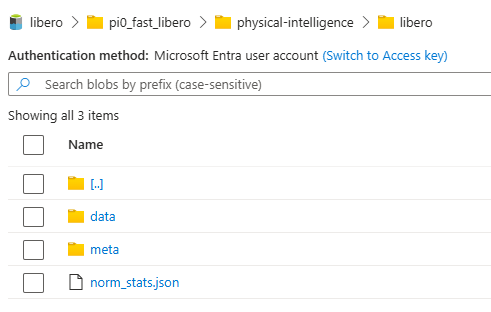

 az ml data create --file aml/dataset.yaml --resource-group robotics-ch-north --workspace-name robotics-ch-north

Allow storage account key access

 az ml environment create --name libero-env --build-context . --dockerfile-path scripts/docker/serve_policy.Dockerfile --resource-group  robotics-ch-north --workspace-name robotics-ch-north

Configure the default storage to allow access from all networks, and allow key access and give myself permission cause I cant change the datastore for the jobs :(
I have to add LEROBOT_HOME, otherwise it will redownload the data. Also, it has to be an output because an input doesnt get substituted correctly.
Dont use a GPU machine.

 az ml job create --file aml/data-norm-stats.yaml --resource-group robotics-ch-north --workspace-name robotics-ch-north

 az ml job create --file aml/train.yaml --resource-group robotics-ch-north --workspace-name robotics-ch-north --set inputs.experiment_name="nabk_03_06" --set compute="nabk-vm-nc96ads-a100"

 We need to mount the adlsgen2 HNS in the AzML

# Instructions to run full fine-tuning on the libero dataset 

## Required resources: 
- Azure ML workspace. In the following examples and AzureML yaml scripts, the workspace is called "robotics-ch-north" and it is in the resource group "robotics-ch-north".
    - Users need "AzureML Data Scientist" role
- Azure ML GPU compute instance. In the following examples and AzureML yaml scripts it is called "vm-nc96ads-a100".
    - With at least one A100 GPU with 80GB of memory
    - With a system/user assigned managed identity
- Azure ML CPU compute instance. In the following example and AzureML yaml scripts it is called "vm-d48a-v4".
    - With at least 64 GB RAM. 
    - Wtih a system/user assigned managed identity.
- ADLS Gen2 storage account with hierarchical namespace enabled. In the following examples and AzureML yaml scripts, the storage account and used container are called "libero". 
    - Users and VM identities need "Storage blob data contributor" role
    - The "libero" container in the "libero" storage account needs to be added as an Azure ML datastore (make sure to mount it as ADLS Gen2 with HNS otherwise you'll face Os.Errors during checkpoint writing!)

## Create the AzureML environment

First, let's create the AzureML environment. We'll call it libero-env
```
 az ml environment create --name libero-env --build-context . --dockerfile-path scripts/docker/serve_policy.Dockerfile --resource-group  robotics-ch-north --workspace-name robotics-ch-north
```

## Download the libero dataset and generate norm stats

Next, let's download our dataset and upload it to the "libero" container in the "libero" storage account. Then we will generate the norm stats of the dataset and upload them to the same location.

### Download the libero dataset

> Note: Instructions assume an Azure ML compute instance is used for downloading the dataset. To avoid running out of space, choose an instance with a large storage, such as the memory-optimized [Standard_D15_v2 (20 cores, 140 GB RAM, 1000 GB disk)](https://learn.microsoft.com/en-us/azure/virtual-machines/sizes/memory-optimized/dv2-dsv2-series-memory), for example. You could also run these steps locally or in an AzureML job.

* If not already done, set the git config on your VM:

    ```
    git config --global user.name "Your name"
    git config --global user.email "Your email@address"
    ```

* Install git-lfs on your VM:

    ```
    curl -s https://packagecloud.io/install/repositories/github/git-lfs/script.deb.sh | sudo bash
    sudo apt-get install git-lfs
    ```
* Use git-lfs to download the dataset (preferrably in the /mnt directory of your VM, to avoid space issues):
    
    ```
    (optional) sudo mkdir -p /mnt/data && cd /mnt/data
    git lfs install
    git clone https://huggingface.co/datasets/physical-intelligence/libero
    ```

* Copy the libero dataset to the "libero" container in the "libero" storage account under the path "pi0_fast_libero/physical-intelligence/libero".
   Login with azcopy first. If you are using a VM with managed identity you can use:
   ```
   azcopy login --identity
   ```
   Copy the files
   ```
   azcopy "/path/to/downloaded/libero/dataset/*" "https://libero.blob.core.windows.net/libero/pi0_fast_libero/physical-intelligence/libero/" --recursive=true
   ```

### Generate the norm stats

Now, we calculate the norm stats of the libero dataset.

> Note: This is done in an AzureML job that will write the generated "norm_stats.json" file in the same directory in the "libero" container where we copied the libero dataset. 
  This step cannot run on a VM with GPU, so we use our CPU VM "vm-nc96ads-a100". 
  The generation of the norm stats can also be done locally instead of in an AzureML job, then you can copy the generated "norm_stats.json" file manually into the correct location in the "libero" container using azcopy as we did in the previous step. 

```
 az ml job create --file aml/data-norm-stats.yaml --resource-group robotics-ch-north --workspace-name robotics-ch-north --set compute="vm-d48a-v4"
```

The data should be ready at this point. Your container structure should resemble:



## Run the fine-tuning -- check latest works

We can now run the fine-tuning. Select your own experiment name.
```
az ml job create --file aml/train.yaml --resource-group robotics-ch-north --workspace-name robotics-ch-north --set inputs.experiment_name="my_experiment" --set compute="vm-nc96ads-a100"
```